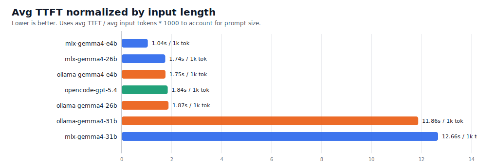
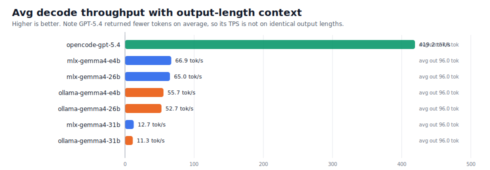
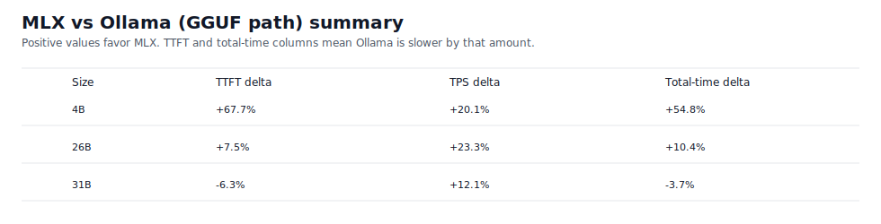

# Quick Benchmark Readout

Source: `results/final-benchmark-results.csv`

## Machine

- MacBook Pro (`Mac16,8`)
- Apple `M4 Pro` with `12` CPU cores (`8P + 4E`) and `16` GPU cores
- `48 GB` unified memory
- `macOS 26.3.1 (a)`

## Benchmark Task

This benchmark is a small long-context zero-shot QA set built from Wikipedia-derived reference bundles. The four tasks ask the model to identify:

- Ada Lovelace
- Alan Turing
- Grace Hopper
- Project Gemini

Prompts were padded to roughly `512`, `2048`, and `8192` input tokens, with `max_output_tokens=96`. The prompt asks for compact JSON, so the benchmark is mostly testing prompt ingestion (`TTFT`) plus short-answer decode speed (`TPS`).

## Short Answer

Treating the `Ollama` runs as your GGUF baseline: yes, `MLX` is generally better on this machine.

- `4B`: clear MLX win. Relative to Ollama, MLX had about `68%` lower TTFT, `20%` higher TPS, and `55%` lower total wall time.
- `26B`: MLX still wins. It had about `7%` lower TTFT, `23%` higher TPS, and `10%` lower total wall time.
- `31B`: mixed. Ollama was about `6%` better on TTFT and about `4%` better on total wall time, but MLX still decoded about `12%` faster.

If you care most about a balanced local experience, `mlx-gemma4-e4b` was the strongest overall local result in this file.

## Overall Averages

I used `input_tokens` for TTFT comparisons and kept `output_tokens` next to TPS, since `prompt_tokens` are not tokenizer-comparable across Gemma and GPT.

| Label | Runtime | Avg input tok | Avg output tok | Avg TTFT | TTFT / 1k input | Avg TPS | Avg total |
| --- | --- | ---: | ---: | ---: | ---: | ---: | ---: |
| `mlx-gemma4-e4b` | MLX | 3711.8 | 96.0 | 3.879s | 1.045s | 66.85 | 5.317s |
| `mlx-gemma4-26b` | MLX | 3711.8 | 96.0 | 6.469s | 1.743s | 65.01 | 7.949s |
| `mlx-gemma4-31b` | MLX | 3711.8 | 96.0 | 46.980s | 12.657s | 12.65 | 54.572s |
| `ollama-gemma4-e4b` | Ollama | 3711.8 | 96.0 | 6.506s | 1.753s | 55.66 | 8.233s |
| `ollama-gemma4-26b` | Ollama | 3711.8 | 96.0 | 6.952s | 1.873s | 52.74 | 8.775s |
| `ollama-gemma4-31b` | Ollama | 3711.8 | 96.0 | 44.031s | 11.862s | 11.28 | 52.545s |
| `opencode-gpt-5.4` | GPT API | 3689.9 | 57.6 | 6.795s | 1.842s | 419.25 | 7.055s |

## MLX vs GGUF/Ollama

- `4B` and `26B` are the main story: MLX is better on both prompt ingestion and decode speed.
- The `4B` MLX result is especially strong: about `1.05s` TTFT per `1k` input tokens versus about `1.75s` for Ollama.
- `26B` is close on TTFT, but MLX still holds a big decode advantage: about `65 tok/s` versus about `53 tok/s`.
- `31B` looks near the edge of comfort for this setup. Both runtimes have very high TTFT on `~8k` token prompts (`~95-105s`), so the practical difference there is smaller than the absolute wait time.

## GPT API Comparison

- `GPT-5.4` crushes decode speed: about `419 tok/s` average versus about `53-67 tok/s` for the faster local runs.
- But that is not a pure apples-to-apples TPS win, because GPT returned shorter answers: about `57.6` output tokens on average versus `96` for every local run.
- Even with that caveat, GPT generation time is tiny: about `0.17s` on average.
- TTFT is not dominant though. `GPT-5.4` average TTFT (`6.795s`) is worse than `mlx-gemma4-e4b`, slightly worse than `mlx-gemma4-26b`, and only clearly better than the `31B` local runs.
- In total wall-clock time, GPT lands near `mlx-gemma4-26b` and behind `mlx-gemma4-e4b`.

My practical read:

- Best local latency/value: `mlx-gemma4-e4b`
- Best stronger local option: `mlx-gemma4-26b`
- If you want the fastest short-answer decode regardless of local/offline tradeoffs: `GPT-5.4`

## Figures

### TTFT Normalized By Input Length

### Decode Throughput With Output-Length Context

### MLX vs Ollama Summary

## Caveats

- The benchmark config says `repeats=3`, but this final CSV contains one row per task/size/target combination (`84` rows total, all `repeat_index=1`). Treat the results as directional rather than statistically stable.
- `GPT-5.4` uses a different tokenizer, so `prompt_tokens` are not directly comparable to the Gemma runs. `input_tokens` is the safer normalization field here.
